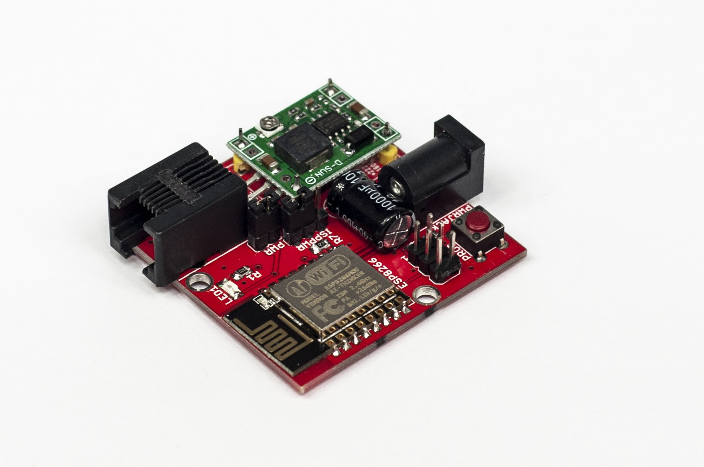
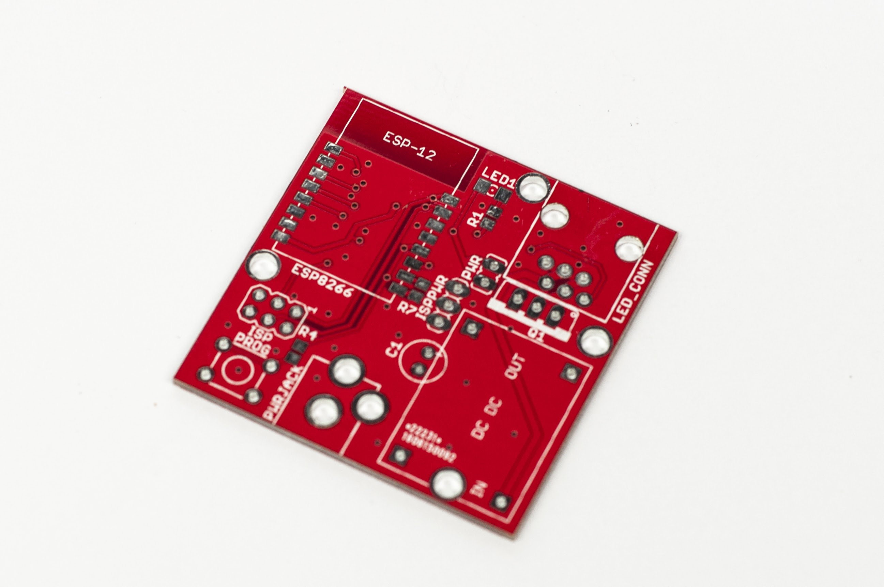
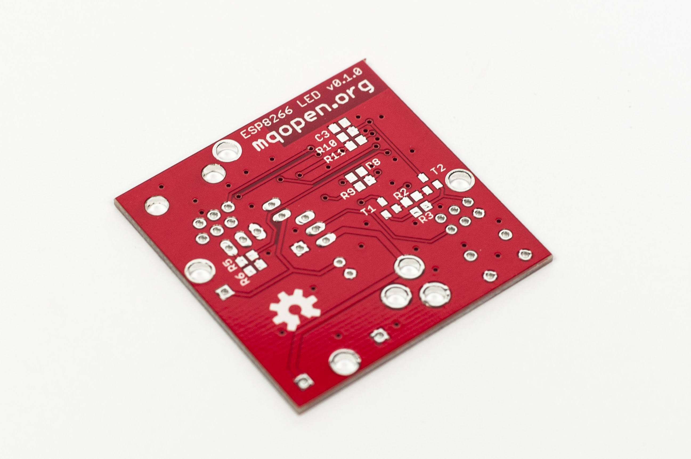
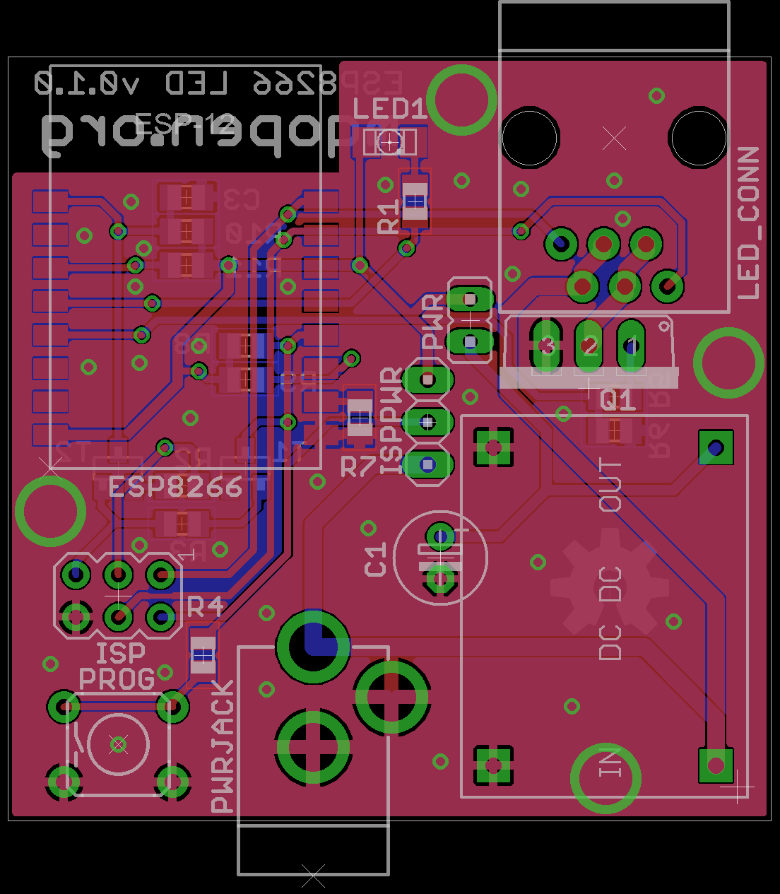

# ESP8266 LED Node PCB

## Features

 - Powered by mini DC-DC power supply module ([LM2596](http://www.ti.com/lit/ds/symlink/lm2596.pdf) chip).
 - 5.5 mm center positive jack.
 - On-board programming connector.
 - Programming push button.
 - Jumper for enabling power supply module.
 - Notification LED.
 - Intended to be manufactured by [dirtypcbs.com](http://dirtypcbs.com/).
 - AVR like ISP header for in circuit programming.
 - MOSFET transistor. 
 - RJ-11 connector for connecting LED strips.

## Images

## Get board

You can order PCB on this [link](http://dirtypcbs.com/store/designer/details/9988/967/esp8266-led-v0-1-0-zip).
